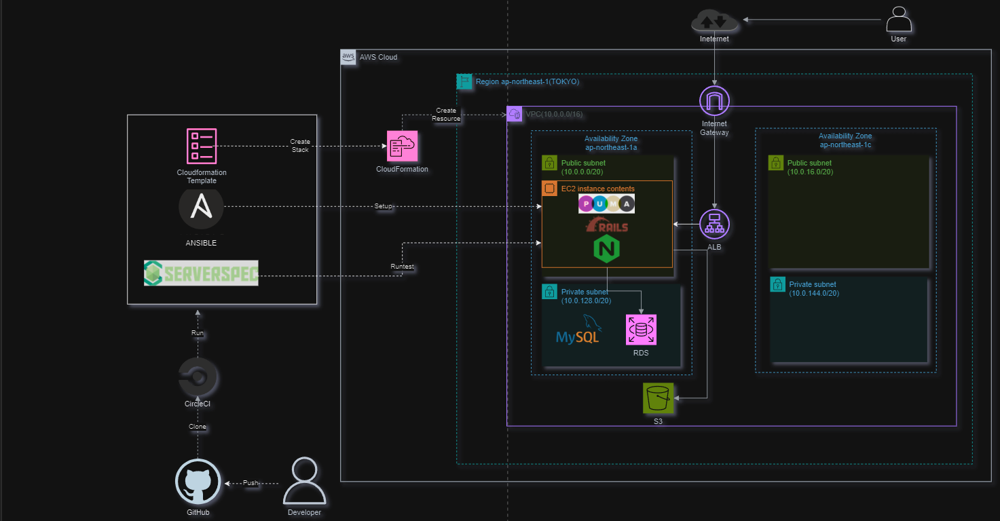

# RaiseTech AWS フルコース
## 学習内容の概要
### EC2 上に Ruby on Rails のサンプルアプリケーションをデプロイ 
- 組み込みサーバ ( Puma ) でデプロイ
- Web サーバ ( Nginx ) + アプリケーションサーバ ( Puma ) でデプロイ
- ELB ( ALB ) 、 S3 を追加
### CloudFormation を用いたインフラ環境/リソースの構築
- 課題5で作成した環境を作成するテンプレートファイルを作成
- 作成したテンプレートファイルからスタックを作成
### CircleCI を用いた CI/CD 環境の構築
  * CloudFormation を実行し、 AWS 環境の構築を自動化する
  * Ansible を実行する
  * ServerSpec を実行し、テストを自動化する
## 構成図 

## 学習記録
| No. | 概要 | 課題 | レポート |  
| :---: | :--- | :--- | :---: |
| 1 | AWSについて | <ul><li>AWS アカウントを作成<li>IAM の推奨設定 ( MFA, Billing, AdministratorAccess )<li>Amazon Linux 2 で作成した Cloud9 で Rubyで HelloWorld を出力 | - |
| 2 | バージョン管理・MarkDown記法 | <ul><li>GitHub でリポジトリを作成<li>Cloud9 の Git 設定変更<li>講座の感想を Markdown で書き、プルリクエストを発行 | [lecture02.md](./lecture02.md) |
| 3 | Web アプリケーションのデプロイ<li>システム開発プロセス</li><li>アプリケーションサーバ</li> | <ul><li>サンプルアプリケーションの起動（デプロイ）し、ブラウザからアクセス<li>AP サーバー、 DB サーバーについて調べる(サーバーの名前・バージョン)<li>課題から学んだことをまとめる | [lecture03.md](./lecture03.md) |
| 4 | 環境構築（手動） （VPC、EC2、RDS） | <ul><li>AWS 上に新しく VPC を作成し、 EC2 と RDS を構築<li>EC2 から RDS へ接続し、正常であることを確認 | [lecture04.md](./lecture04.md) |
| 5 | 環境構築（手動）<li>サンプルアプリケーション</li><li>ELB（冗長化・負荷分散）</li><li>S3</li> | <ul><li>EC2 上に第 3 回課題のサンプルアプリケーションをデプロイ<li>まずは組み込みサーバー ( puma ) だけでデプロイ<li>動作したらサーバーアプリケーションを分けてデプロイ ( Puma + Nginx )<li>ELB の追加<li>S3 の追加<li>構成図の作成 | [lecture05.md](./lecture05.md) |
| 6 | システムの安定稼働（AWSでの証跡、ロギング、監視、通知、コスト管理） | <ul><li>最後に AWS を利用した日の記録を CloudTrail のイベントから探し出す<li>自身の IAM ユーザー名があるもの<li>見つけたイベントのイベント名と含まれている内容を 3 つピックアップ<li>CloudWatch アラームを使って、 ALB のアラームを設定して、メールを通知する<li>メールには Amazon SNS を使用<li>アラームとアクションを設定した状態で、 Rails アプリケーションが使える・使えない状態それぞれで動作を確認 | [lecture06.md](./lecture06.md) |
| 7 | システムにおけるセキュリティの基礎、 AWS でのセキュリティ対策 | <ul><li>これまでに作成した環境は、どのような攻撃に対して「脆弱」か、また、どのような対策が取れそうかを考えてまとめる | [lecture07.md](./lecture07.md) |
| 8 | 構築の実演 ( 1 ) | 
- | - |
| 9 | 構築の実演 ( 2 ) | 
- | - |
| 10 | インフラ自動化、 CloudFormationについて | <ul><li>CloudFormation を利用して、これまでに作成した環境をコード化する<li>コード化ができたら実行して、環境が自動で作られていることを確認する | [lecture10.md](./lecture10.md) |
| 11 | インフラのコード化を支援するツール、インフラのテストとは | <ul><li>ServerSpec のテストが成功することを確認する<ul><li>提供されるサンプルをカスタマイズする | [lecture11.md](./lecture11.md) |
| 12 | Terraform、 DevOps 、 CI/CD ツールとは | <ul><li>提供される CircleCI のサンプルコンフィグを、正しく動作するようにリポジトリに組み込む | [lecture12.md](./lecture12.md) |
| 13 | Ansible 、 OpsWorks 、 CircleCI との併用 | <ul><li>CircleCI のサンプルに ServerSpec と Ansible の処理を追加する | [lecture13.md](./lecture13.md) |
| 14 | ライブコーディング ( Ansible 〜 CircleCI ) | <ul><li>これまでの AWS 構成図、自動化処理がわかる図、リポジトリの README を作る | - |
| 15 | ライブコーディング ( Ansible 〜 CircleCI ) | <ul><li>これまでの AWS 構成図、自動化処理がわかる図、リポジトリの README を作る | - |
| 16 | 現場へ出ていくにあたって必要な技術と知識、現場での立ち振る舞い | 
- | - |

