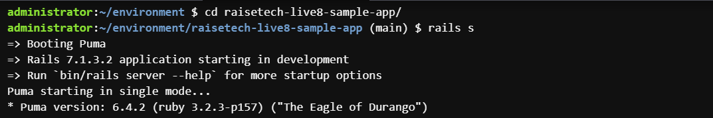
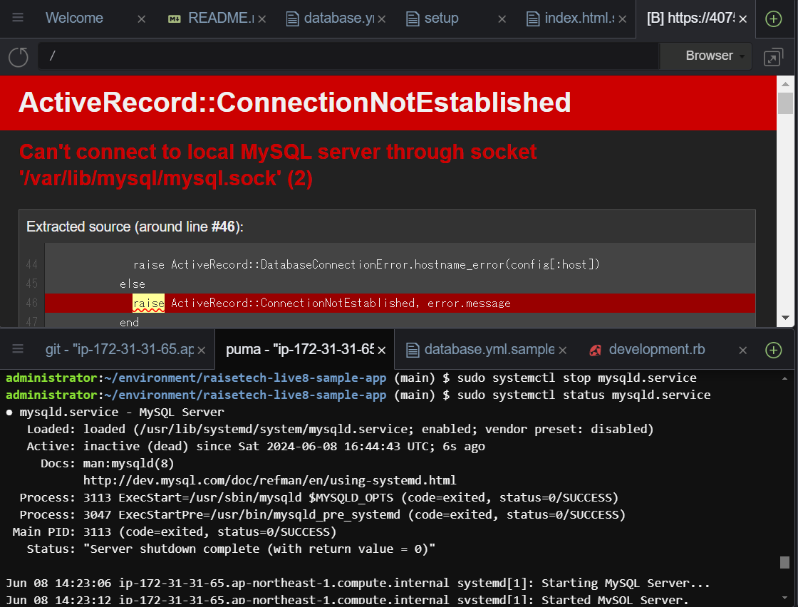
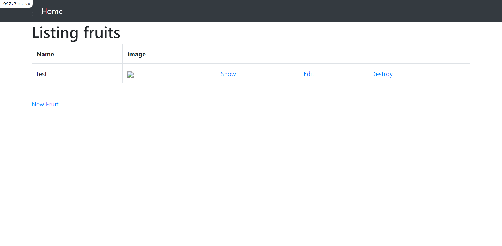

## 第三回課題

* APサーバの名前とバージョン（puma ver6.4.2) 　
  

* APサーバーを終了させた場合(アクセスできない)  
  

* DBサーバーの名前とバージョン(Mysql ver8.4.0)    
  

* DBサーバーを終了させた場合(アクセスできない)  
  

* Railsの構成管理ツール(Bundler)　　
  

* 第3回の課題を通して感じたこと     
-socketの場所を間違えていてうまくいってなかったが、エラーメッセージを読んで解決できた。　　
-今回は少し難易度が高く時間がかかってしまった。
