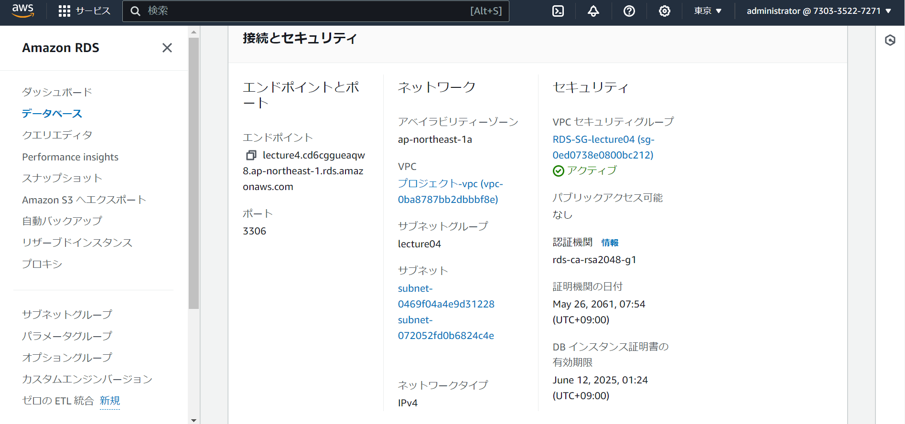
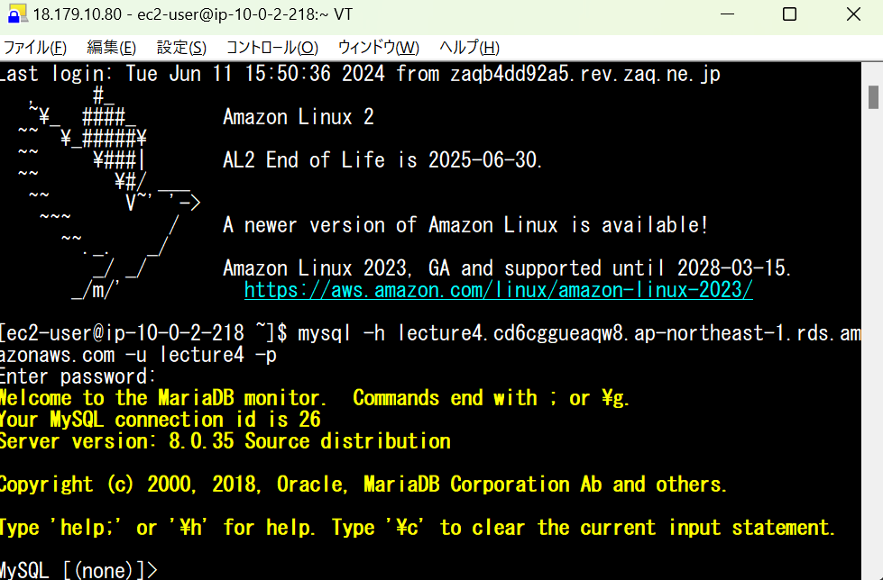

# 第4回課題

## 1. VPCの作成

## 2. EC2およびRDSの構築
1. EC2
* EC2の作成

* セキュリティグループの作成

2. RDS
* RDSの作成

* RDSのセキュリティグループの作成

## 3. EC2からRDSへの接続

## 4. 今回の課題から感じたこと学んだこと
* CloudTechにて環境構築をハンズオンでやっていたので理解しやすくこなせた。
* EC2からRDSへの接続はEC2にmysqlをインストールし、RDSのエンドポイントに接続することで接続できた。以前していたのでこなしやすかった。
* 第三回の課題がかなり難しかったのでそれに比べると少し難易度は低いと感じた。

