# 第5回課題

## 1.組み込みサーバ（Puma）だけで動作確認

## 2.組み込みサーバとUnix Socketを使ったRailsアプリの動作確認
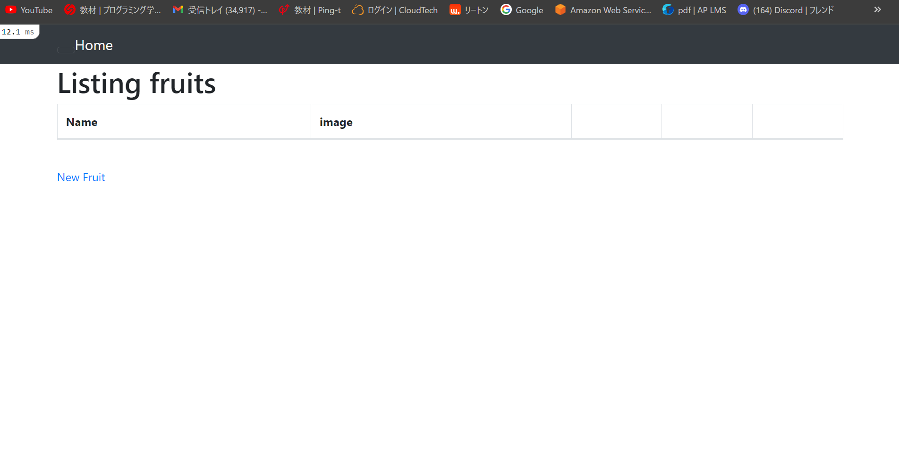

## 3.Nginxの単体起動確認
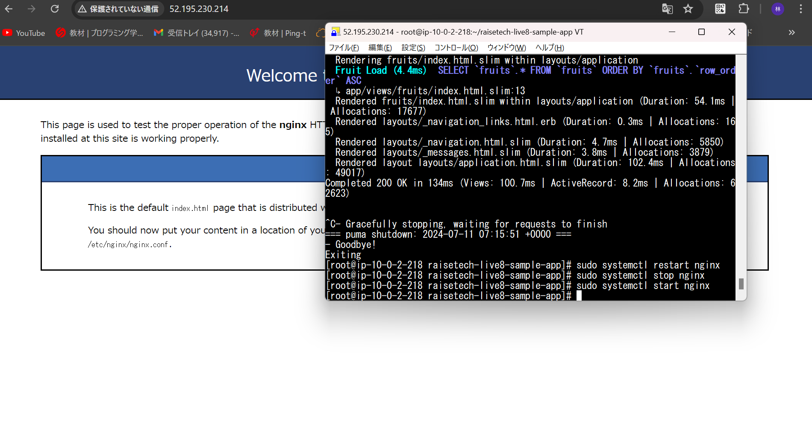

## 4.NginxとPuma、UnixSocketを組み合わせての動作確認
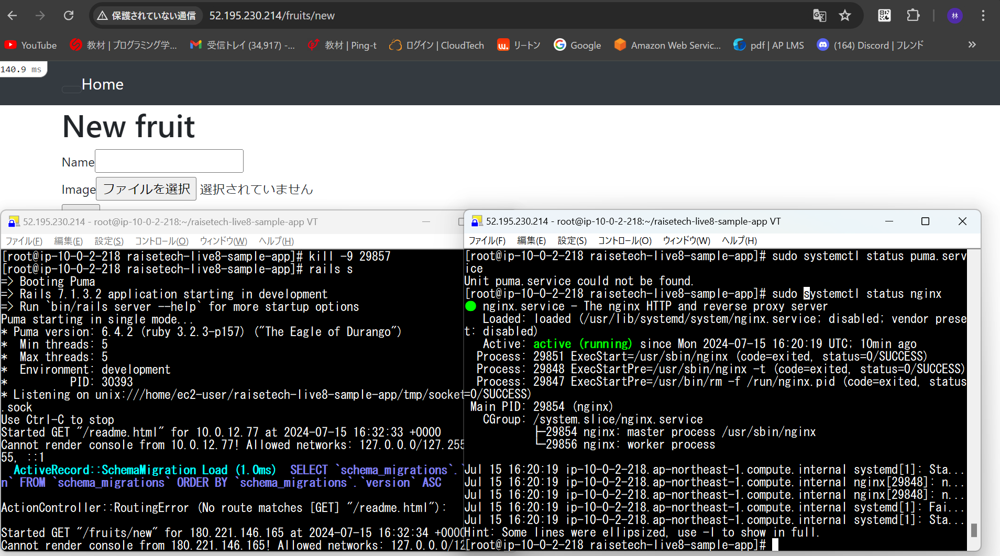

## 5.ELB(ALB)を追加して動作確認
*  ALBのDNS名で動作確認
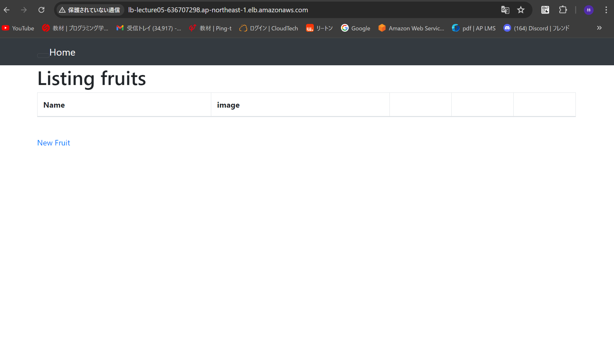

## 6.ALBのインバウンドの設定
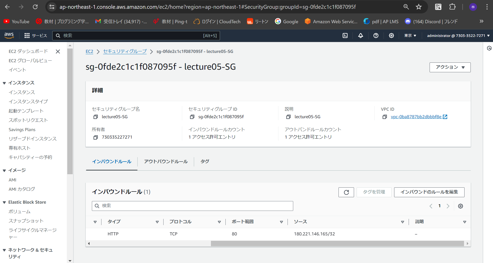

## 7.ALBのアウトバウンドの設定
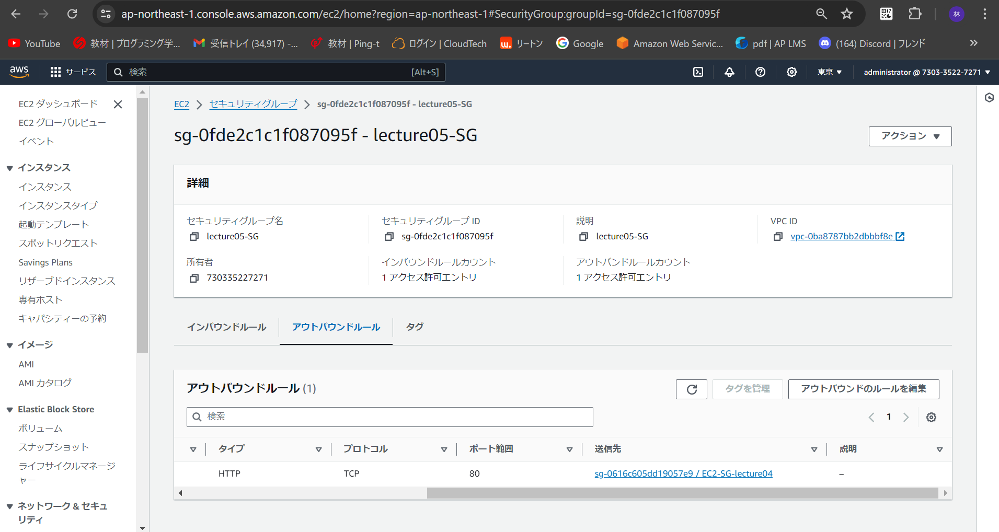

## 8.S3バケットの作成
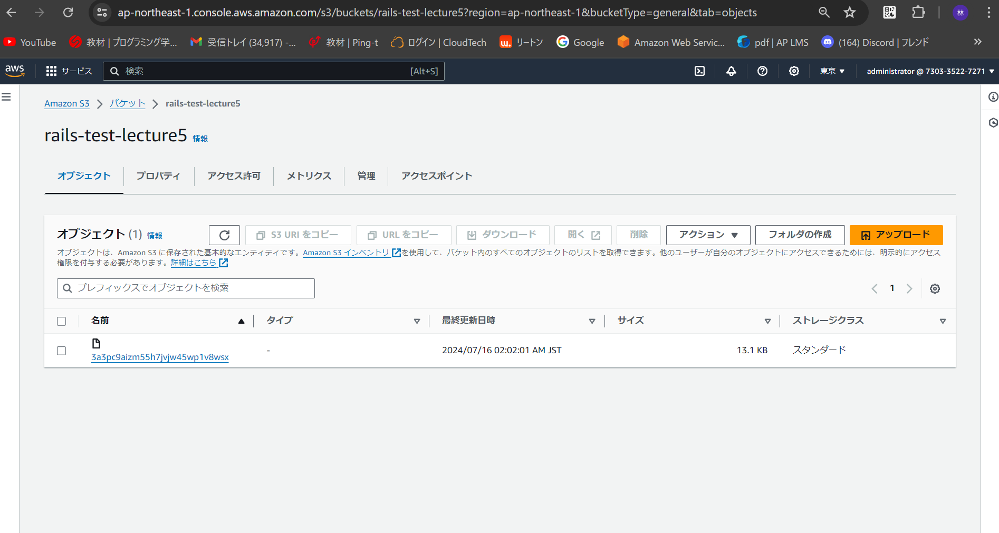

## 9.S3内のオブジェクトとして画像を確認
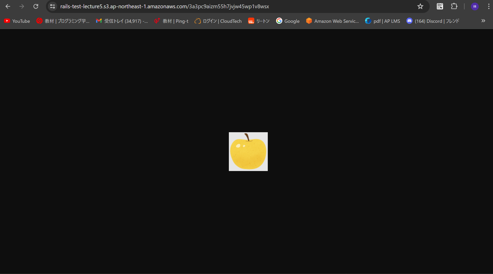

## 10.S3に画像を保存
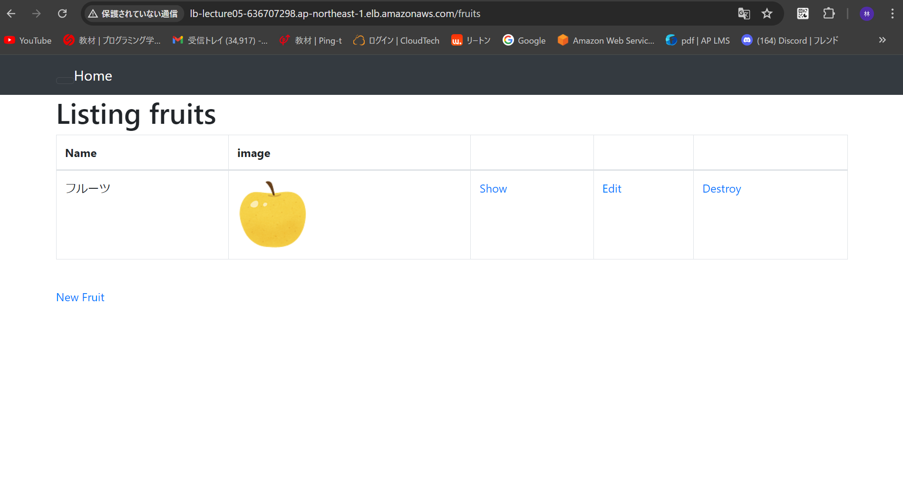

## 11.IAMポリシーの設定
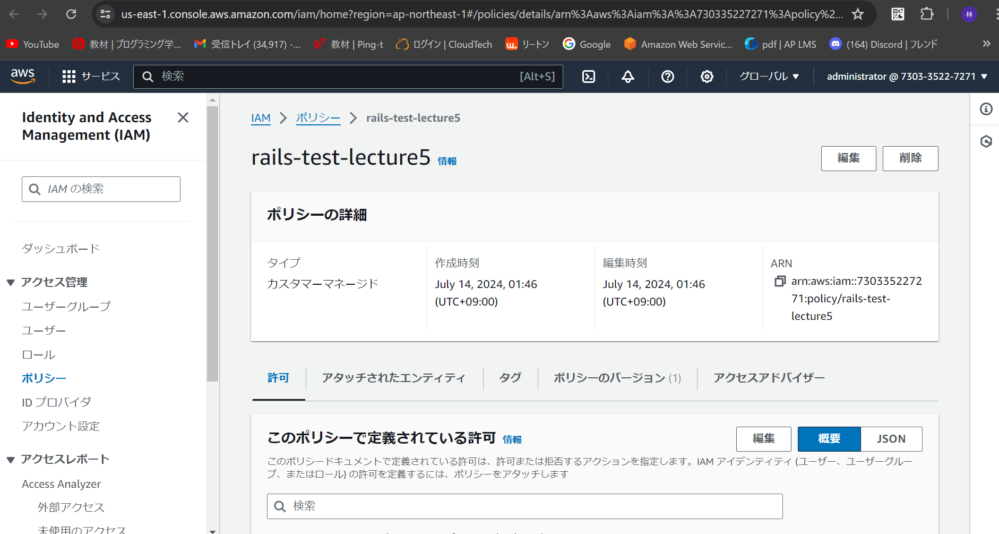
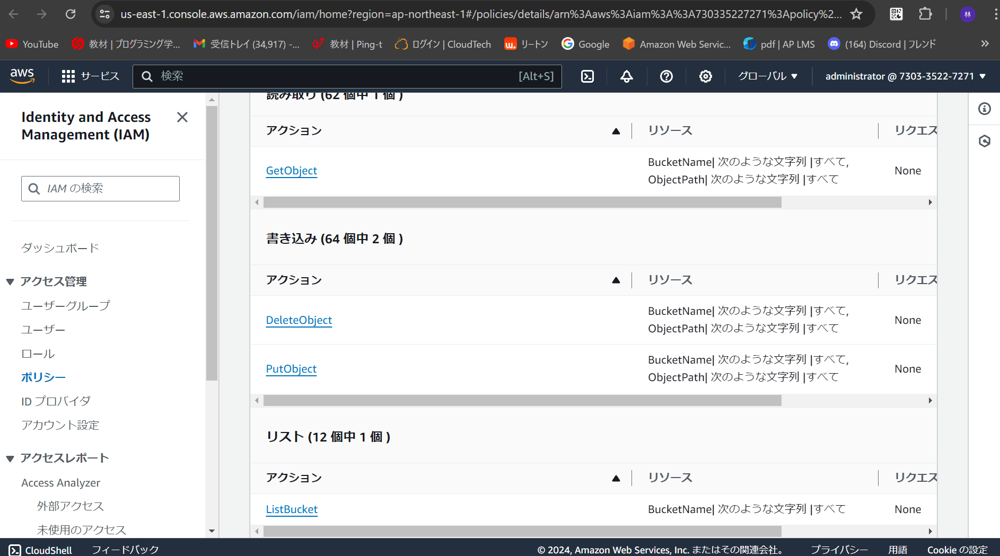

## 12.AWS構成図
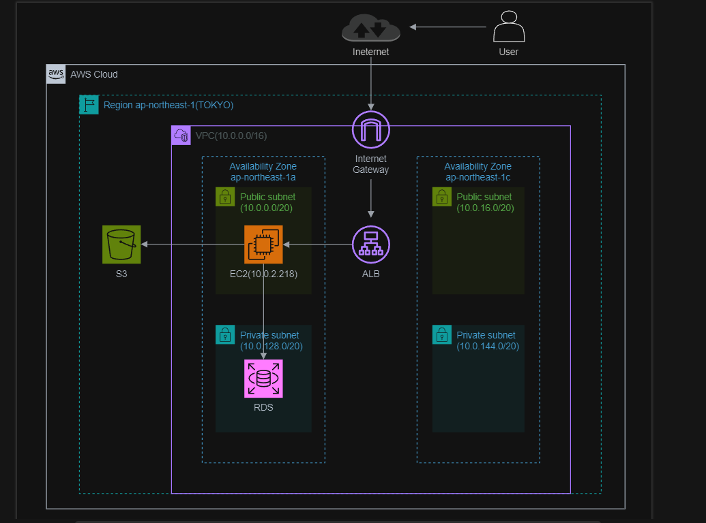

- 　感想

* かなり時間がかかりましたが、何とか課題提出までたどり着くことができました。
* Cloud9とは違いEC2インスタンスに1からインストールなりをしないといけなくて個人的にはかなり難しく感じました。
* 今回の課題を達成するまでの手順を復習し、実際の業務で使うような作業手順書みたいなのをRailsアプリ動作確認の手順書として作成して、同じことをできるようにしたいと思います。
