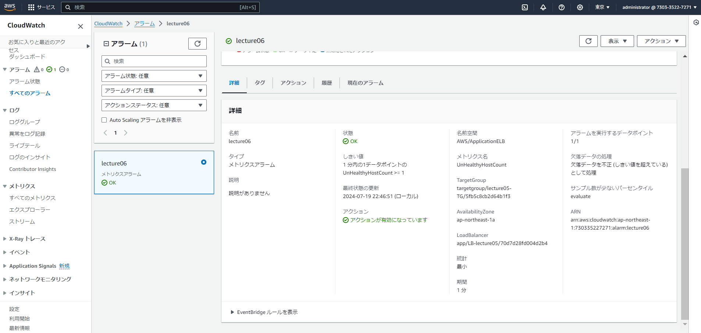

# 第6回課題

## CloudTrailのイベント
* イベント名：ModifyTargetGroup 
* 含まれている内容："healthCheckProtocol":"HTTP"
　　　　　　　　　  "healthCheckPath": "/kkk"
                    "healthCheckIntervalSeconds": 10

# CloudWatchアラームを使用しALBのアラーム設定
* 現在のヘルスチェックがHealthyであることを確認

* 現在の正常な状態のヘルスチェックの設定を確認

* アラームを出すために存在しないヘルスチェックパスを設定

* 存在しないヘルスチェックパスを設定したことにより、ヘルスステータスがUnhealthyになったことを確認

* アラーム状態になったことを確認

* NG状態のメール通知

* OK状態にするため、存在するパスを設定

* ヘルスステータスがHealthyになったことを確認

* 状態がOKのアラーム

* OK状態のメール通知

* webサーバ(nginx)を停止させてターゲットグループunhealthyの状態で確認

* Nginx停止後のヘルスステータスを確認

* Nginx停止後のアラームの状態

* Nginx停止後のメール通知

# AWS利用料の見積もりを作成

見積もりURLは[こちら](https://calculator.aws/#/estimate?id=9f43cdd2b3446e9c2d466499a9c1eddf6d2660e4)

# 現在の利用料を確認
* 現在の利用料 $5.74

* EC2の利用料金 $0.23

* 無料利用枠範囲内かどうか

