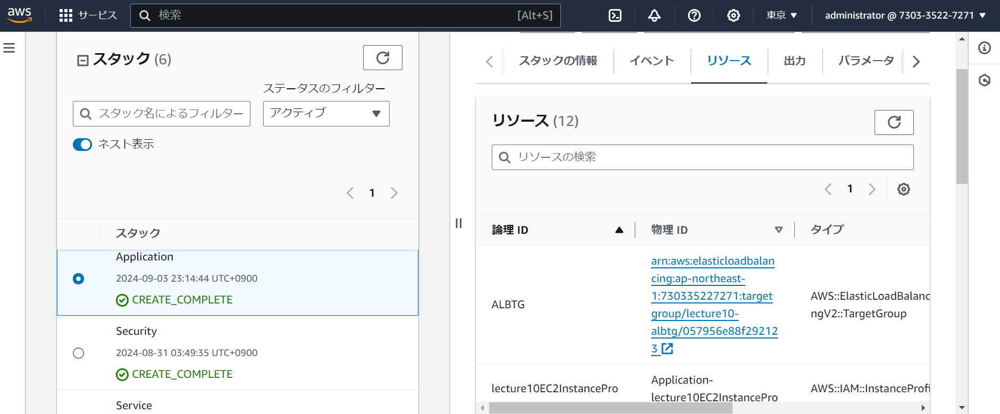

# 第10回課題

## **CloudFormation**を使いこれまでに作成した環境をコード化する

### 概要

**1. VPC**

**2. EC2**

**3. RDS**

**4. ALB**

**5. スタック**

**6. S3**

**7. EC2からRDSへ接続確認**

* * *

### テンプレート

-  [**service.yaml**](CloudFormation/service.yaml)

-  [**Security.yaml**](CloudFormation/Security.yaml)

-  [**Application2.yaml**](CloudFormation/Application2.yaml)

 
### **1. VPC**

 
 
 

### **2. EC2**

 

- #### セキュリティーグループ

### **3. RDS**
    
 

- #### サブネット

 
 
 
 

- #### セキュリティーグループ

 

### **4. ALB**

 

### **5. スタック**

 

### **6. S3**

 

### **7. EC2からRDSへ接続確認**

   

### **感想**
コード化するのはなかなかに難しく、かなり時間がかかってしまった。
まだ、完全に理解したとは言えないと思うので、理解できるよう学習を続けていきたい。
