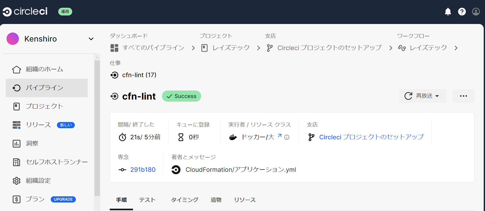
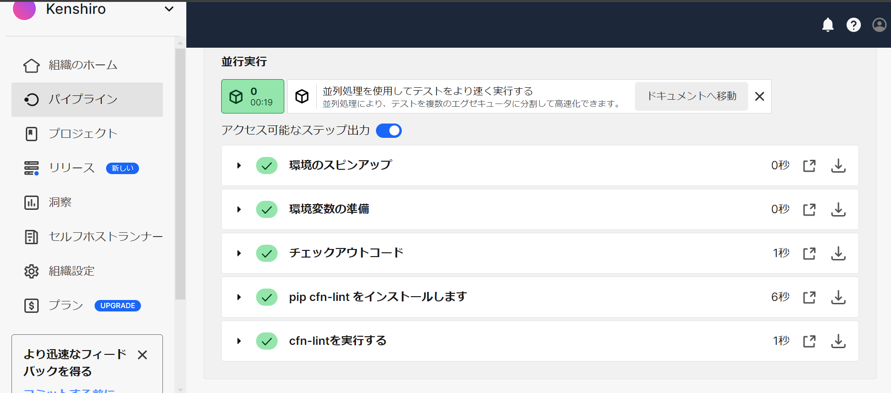

# **第12回課題**

## 課題報告

### circleciを使用し、サンプルコンフィグが正常に動作するようにする
 - circleciのアカウント作成
 - circleciでgithubのリポジトリを指定して、プロジェクトを作成する
 - 自動的にgithub上にcircleci-project-setupブランチが自動で作成される
 - 下記コマンドを実行
```
[ec2-user@ip-10-0-2-218 Portfolio]$ git branch -r
  origin/HEAD -> origin/main
  origin/circleci-project-setup
  origin/lecture02
  origin/lecture03
  origin/lecture04
  origin/lecture05
  origin/lecture06
  origin/lecture07
  origin/lecture10
  origin/lecture11
  origin/main

 #下記コマンドでcircleci-project-setupのブランチを作成
[ec2-user@ip-10-0-2-218 Portfolio]$ git checkout -b orijin/circleci-project-setup
```

 - config.ymlの詳細は下記参照
```
version: 2.1
orbs:
  python: circleci/python@2.0.3
jobs:
  cfn-lint:
    executor: python/default
    steps:
      - checkout
      - run: pip install cfn-lint
      - run:
          name: run cfn-lint
          command: |
            cfn-lint -i W3002 -t CloudFormation/*.yml

workflows:
  raisetech:
    jobs:
      - cfn-lint
```
  
　

### 今回の課題で学んだこと
- 使用していないParametersとかがあればcfn-lint実行結果がエラートなったり、!Subの使い方がおかしいとエラーが出たり、少し難しかった。
