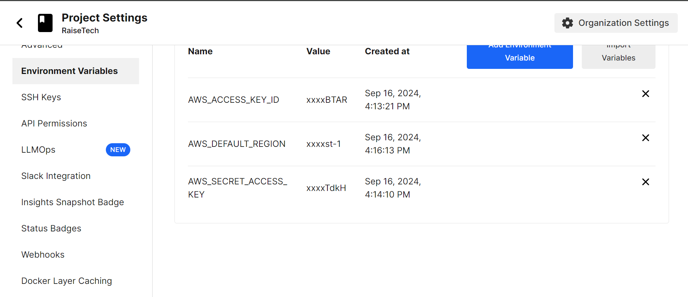
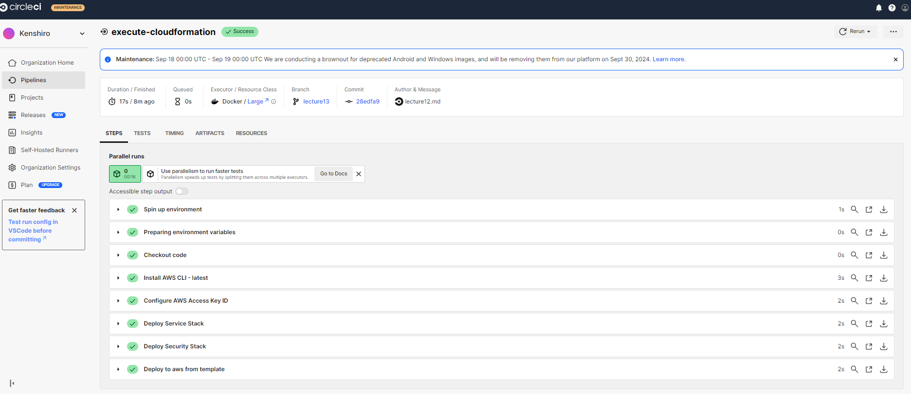
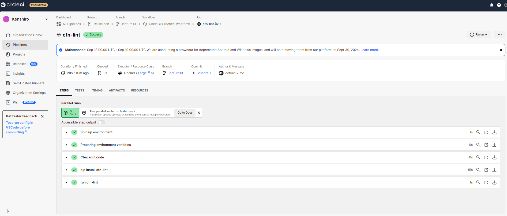
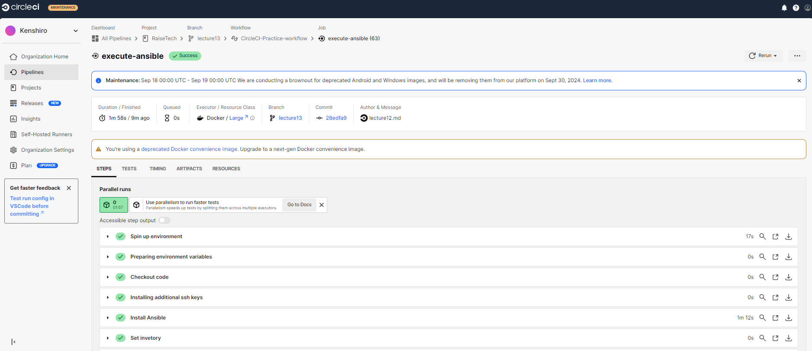
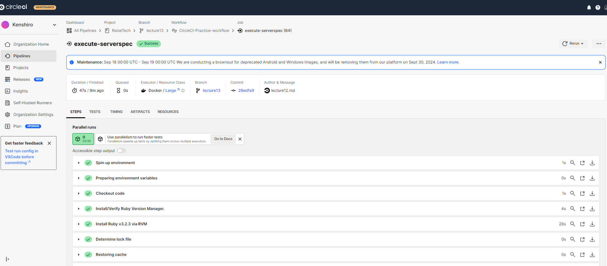

# 第13回課題

## 概要
1. CircleCIのサンプルにServerspecやAnsibleの処理を追加する
2. 感想

### 1.1 CircleCIで環境変数を設定する
- AWS_ACCESS_KEY_ID
- AWS_SECRET_ACCESS_KEY
- AWS_DEFAULT_REGION
 

### 1.2 Cloudformationのスタック作成処理を実行
- 実行結果
 
 
 - 1.3 cfn-lint実行結果
 
 
### 1.4 Ansibleの処理を実行
- 実行結果
 
 
### 1.5 serverspecの処理を実行
- 実行結果
 

## 2. 感想
- 初めは何をどうすればどう動くのかが全く分からず苦戦し、1週間以上もかなり時間がかかりました。
- 実務で使うレベルにはまだまだ程遠いと感じているので引き続き学習が必要だと感じた。
